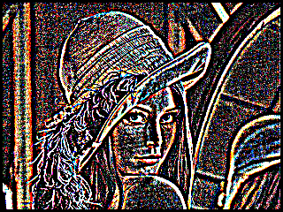

# BmpHandleVerilog

This is an easy to use BMP (Microsoft Bitmap) handling Verilog tasks.

## License
This is licensed with the 3-clause BSD license to make the library useful in open and closed source products independent of their licensing scheme.

# 1. Quick start

   1) go to '$ cd sim/modelsim'
   2) run '$ make cleanup' and then '$ make'
      . It may take time depending on size of image and filter.
   3) preview 'result.bmp'
      '$ display result.bmp' on Ubuntu.

   Note that it works with ModelSim and icarus Verilog, but does not work with Vivado Sim due to $fwriteb() bug.

# 2. Basic usage

### 2.1 TO READ
   1) open a BMP file
      fd_input = $fopen(bmp_input_file_name, "rb");
   2) read BMP
      bmp_read(fd_input, code);
      this step fills 'bmp_file_header[]', 'bmp_image_header[]',
      'pBitMap[]' and others.
   3) close the BMP file if no futher use
      $fclose(fd_input);
   4) do your operation on 'pBitMap[0:biSizeImage-1]',
      which is 8-bit array containing BGR color components.
      E.g., pBitMap[0] will be Blue of the first pixel,
            pBitMap[1] will be Green of the first pixel,
            pBitMap[2] will be Red of the first pixel,
            pBitMap[N*3] will be Blue of the N-th pixel,
            pBitMap[N*3+1] will be Green of the N-th pixel,
            pBitMap[N*3+2] will be Red of the N-th pixel.

### 2.2 TO WRITE
   1) open a file to store BMP
      fd_output = $fopen(bmp_output_file_name, "wb");
   2) fills 'bmp_file_header[]', 'bmp_image_header[]', 'pBitMap[]'
      bmp_gen_file_header(); bmp_gen_img_header(); ...
   3) write file
        bmp_write(fd_output, code);
        $fclose(fd_output);
# 3. Edge detection example

```
                     mod_bmp       mod_mem       mod_edge
   +-----+          +---------+    +--------+    +--------+
   |BMP  |---read-->|         |    |        |    |        |
   |     |          |         |    |        |    |        |
   +-----+          |         |--->|        |--->|        |
                    |         |    |        |    |        |
   +-----+          |         |<---|        |<---|        |
   |BMP  |<--write--|         |    |        |    |        |
   |     |          |tasks_bmp|    |        |    |        |
   +-----+          +---------+    +--------+    +--------+
                         ||            ||             ||
                    +-------------------------------------+
                    |           control                   |
                    +-------------------------------------+
```

   'top.v' controls overall steps by using handshake signals.
   'mod_bmp.v' first reads BMP file and writes bitmaps to 'mod_mem' using task call.
   'mod_edge.v' first read BMP from 'mod_mem' and performs edge detection and then writes the result to 'mod_mem'.
   'mod_bmp.v' reads bitmap result and then writes to BMP file.
 
    &npsp; &npsp; 
   
   
# 4. Revision history
   * 2018.08.03: 'bmp_read_img_header' of 'tasks_bmp.v' has been update to support ImageHead Version 4.
